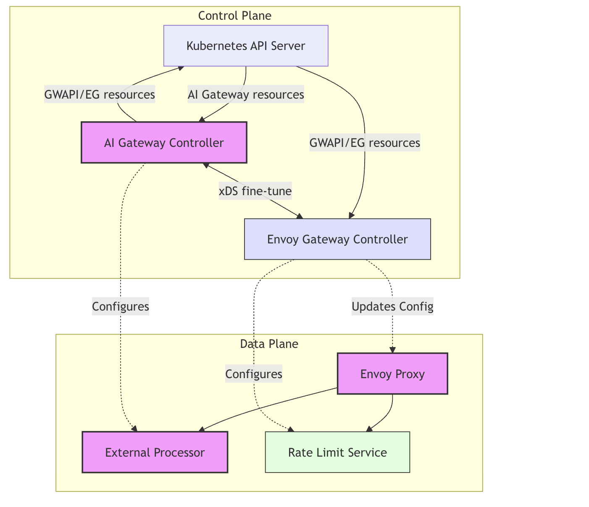
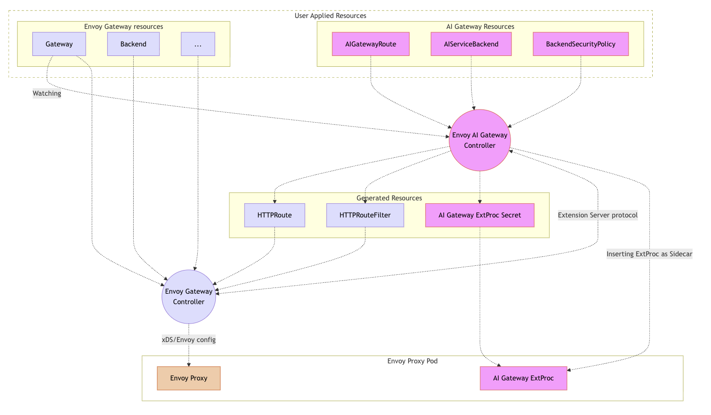
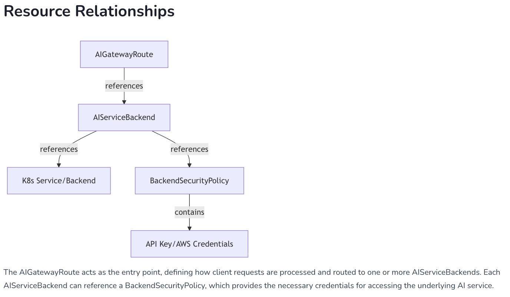
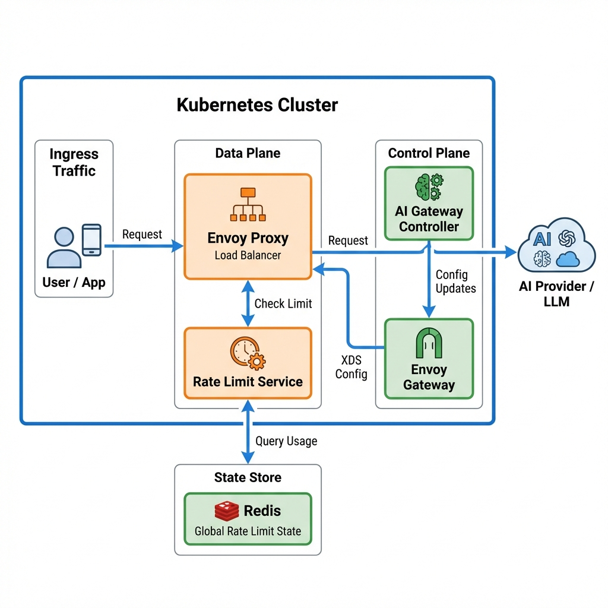
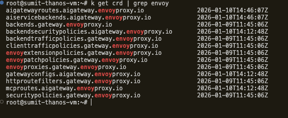
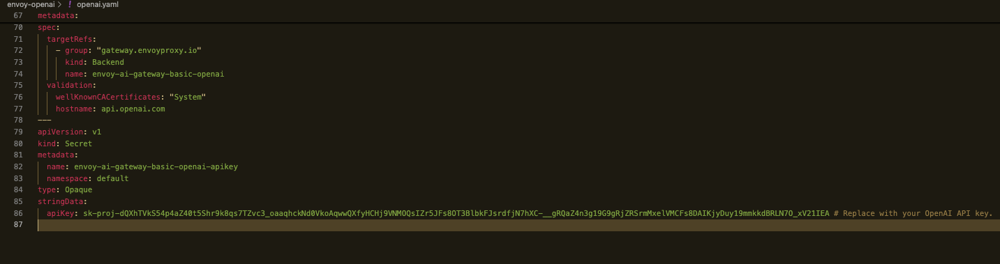
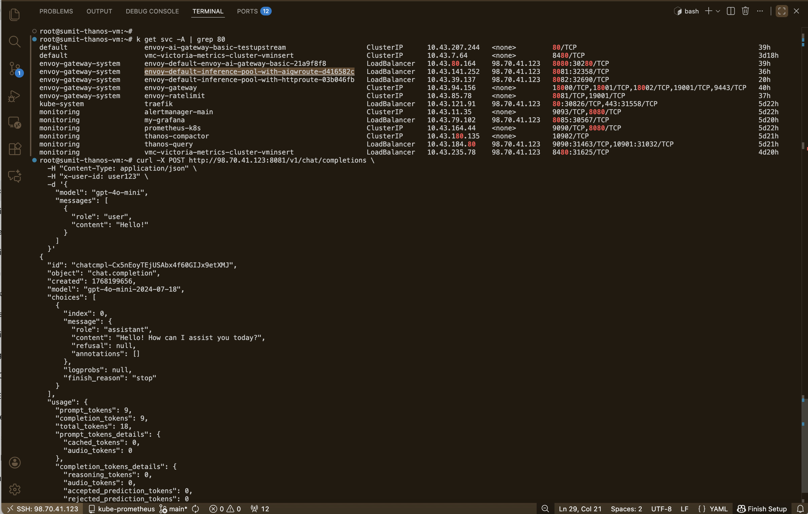
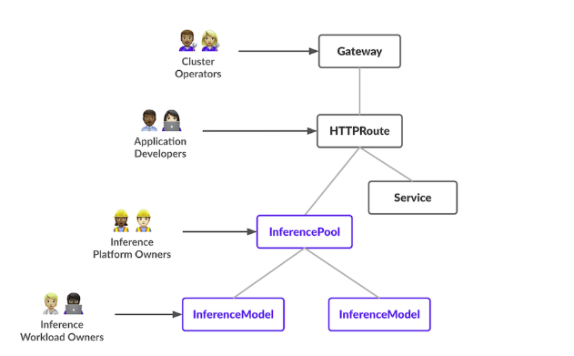

# Envoy AI Gateway Technical Architecture and Installation Guide

## Introduction

The **Envoy AI Gateway** is a powerful intermediary that sits between your applications and Large Language Model (LLM) providers like OpenAI, Anthropic, or self-hosted models. It solves the critical challenges of adopting AI in enterprise environments by providing a unified control plane for:

*   **Traffic Management**: Intelligent routing, load balancing, and failover.
*   **Cost Control**: Granular rate limiting and token usage quotas.
*   **Security**: Centralized API key management and access policies.
*   **Observability**: Deep visibility into model usage, latency, and costs.

This guide will walk you through the architecture, installation, and configuration of the Envoy AI Gateway on a Kubernetes cluster.

## 1. Prerequisites

Before proceeding with the installation, ensure the following tools are installed and configured on your machine.

| Tool | Minimum Version | Purpose |
| :--- | :--- | :--- |
| **Kubernetes Cluster** | v1.26+ | The container orchestration platform where the gateway will run. |
| **Helm** | v3.0+ | A package manager for Kubernetes, used to install the software. |
| **kubectl** | Latest | The command-line tool for interacting with your Kubernetes cluster. |
| **OpenAI API Key** | N/A | Required if you plan to use OpenAI as a model provider. |

---

## 2. Architecture Overview

The Envoy AI Gateway is designed to manage and route traffic to Large Language Models (LLMs) efficiently. It separates the **Control Plane** (management) from the **Data Plane** (traffic handling).





### Component Definitions

To ensure clarity, here are definitions for the key components used in this system:

*   **Control Plane**: The part of the system that configures the network. It makes decisions about where traffic should be sent. In this context, the **AI Gateway Controller** acts as the control plane.
*   **Data Plane**: The part of the system that actually forwards the network packets. **Envoy Proxy** acts as the data plane, handling every incoming API request.
*   **Custom Resource Definition (CRD)**: A custom extension to the Kubernetes API. We use CRDs to define AI-specific concepts like "Models" and "Providers" directly in Kubernetes.
*   **Redis**: A fast, in-memory data store. It is used here to keep track of usage limits (rate limiting) across the entire system.
*   **Upstream / Backend**: The destination where the request is ultimately sent. This could be OpenAI, Anthropic, or a self-hosted model running on your own servers.

---

## 3. Detailed Architecture Breakdown

### 3.1. The AI Gateway Controller
The controller watches for changes you make to the configuration (via CRDs) and translates them into instructions for the Envoy Proxy. It ensures the proxy always knows how to route traffic for the configured models.

### 3.2. Envoy Proxy (The Gateway)
This is the high-performance server that receives requests from your applications. It performs:
1.  **Authentication**: Verifying who is sending the request.
2.  **Routing**: Deciding which model provider should handle the request based on headers.
3.  **Rate Limiting**: Checking Redis to ensure the user hasn't exceeded their budget.

### 3.3. Configuration Resources
We use specific Kubernetes resources to configure the behavior. The diagram below illustrates how these resources interact to handle a request.



*   **`AIGatewayRoute`**:
    *   **Purpose**: The entry point for the gateway. It defines the unified API schema (e.g., OpenAI compatible) and specifies the routing rules.
    *   **Key Features**:
        *   **Routing**: Directs traffic to specific backends based on headers or paths.
        *   **Cost Tracking**: Tracks token usage for billing and rate limiting.
        *   **Schema Translation**: Converts requests/responses if the backend uses a different API format.

*   **`AIServiceBackend`**:
    *   **Purpose**: Represents a specific AI provider or model endpoint (e.g., "My Hosted Llama" or "OpenAI GPT-4").
    *   **Key Features**:
        *   **Output Schema**: Defines what the backend expects (e.g., AWS Bedrock format).
        *   **Service Reference**: Points to the actual Kubernetes Service or external URL.

*   **`BackendSecurityPolicy`**:
    *   **Purpose**: Manages the sensitive credentials required to access the AI Service.
    *   **Key Features**:
        *   **Credential Injection**: Securely adds API keys or AWS signatures to requests.
        *   **Security**: Ensures credentials are never exposed to the client application.

**Relationship Flow**:
1.  A request hits the **`AIGatewayRoute`**.
2.  The route forwards it to an **`AIServiceBackend`**.
3.  The backend uses a **`BackendSecurityPolicy`** to sign/authenticate the request before sending it to the provider.

---

## 4. Installed Components & Stack

This section details the critical components of the Envoy AI Gateway running in your Kubernetes cluster.

### 4.1. Architecture Diagram

The following diagram illustrates the interaction between the Control Plane, Data Plane, and Rate Limiting components within the cluster.



### 4.2. Core Components

*   **AI Gateway Controller** (`envoy-ai-gateway-system`):
    *   **Role**: The "Brain" of the AI Gateway.
    *   **Function**: It watches for Kubernetes Custom Resources (like `AIGatewayRoute`) and translates high-level AI intents into specific configuration for the Envoy Gateway.

*   **Envoy Gateway** (`envoy-gateway-system`):
    *   **Role**: The Control Plane.
    *   **Function**: Manages the lifecycle of Envoy Proxies and translates Kubernetes Gateway API resources into Envoy xDS configuration.

*   **Envoy Proxy** (`envoy-gateway-system`):
    *   **Role**: The Data Plane.
    *   **Function**: The actual high-performance proxy that processes every request. It handles:
        *   **Routing**: Directing traffic to the correct AI provider.
        *   **Header Manipulation**: Injecting API keys securely.
        *   **Load Balancing**: Distributing traffic for inference pools.

### 4.3. Rate Limiting Components

*   **Redis** (`redis-system`):
    *   **Role**: Global State Store.
    *   **Function**: Stores real-time counters for token usage (e.g., "User X has used 500 tokens this hour"). It enables rate limiting to work across multiple replicas of the gateway.

*   **Envoy Rate Limit Service** (`envoy-gateway-system`):
    *   **Role**: Policy Enforcer.
    *   **Function**: A gRPC service that the Envoy Proxy calls to check if a request should be allowed based on the data in Redis.

---

## 5. Step-by-Step Installation Guide

Follow these steps exactly to get a working Envoy AI Gateway up and running.

### Step 1: Install Custom Resource Definitions (CRDs)

We first need to teach Kubernetes about our new AI-specific resource types.



Run the following command in your terminal:

```bash
helm upgrade -i aieg-crd oci://docker.io/envoyproxy/ai-gateway-crds-helm \
  --version v0.0.0-latest \
  --namespace envoy-ai-gateway-system \
  --create-namespace
```

### Step 2: Install the AI Gateway Controller

Next, we install the controller which will manage our gateway.

1.  Run the installation command:
    ```bash
    helm upgrade -i aieg oci://docker.io/envoyproxy/ai-gateway-helm \
      --version v0.0.0-latest \
      --namespace envoy-ai-gateway-system \
      --create-namespace
    ```

2.  **Verification**: Wait until the controller is fully running.
    ```bash
    kubectl wait --timeout=2m \
      -n envoy-ai-gateway-system deployment/ai-gateway-controller \
      --for=condition=Available
    ```
    *Success Message*: You should see `deployment.apps/ai-gateway-controller condition met`.

### Step 3: Install Envoy Gateway

Now we install the actual proxy software.

1.  Run the command:
    ```bash
    helm upgrade -i eg oci://docker.io/envoyproxy/gateway-helm \
      --version v0.0.0-latest \
      --namespace envoy-gateway-system \
      --create-namespace \
      -f https://raw.githubusercontent.com/envoyproxy/ai-gateway/main/manifests/envoy-gateway-values.yaml
    ```

2.  **Verification**:
    ```bash
    kubectl wait --timeout=2m \
      -n envoy-gateway-system deployment/envoy-gateway \
      --for=condition=Available
    ```

### Step 4: Deploy a Basic Gateway

Create the basic gateway listener that will accept HTTP traffic.

```bash
kubectl apply -f https://raw.githubusercontent.com/envoyproxy/ai-gateway/main/examples/basic/basic.yaml
```

### Step 5: Configure OpenAI Provider

To serve requests using OpenAI, we must configure the credentials and routing.



1.  **Download the configuration file**:
    ```bash
    curl -O https://raw.githubusercontent.com/envoyproxy/ai-gateway/main/examples/basic/openai.yaml
    ```

2.  **Add your API Key**:
    Open the `openai.yaml` file in a text editor. Find the section for `Secret` and replace the placeholder or existing key with your actual OpenAI API Key.

3.  **Apply the configuration**:
    ```bash
    kubectl apply -f openai.yaml
    ```

### Step 6: Verify the Installation

You can now test if the gateway is working by sending a request.

1.  **Get the Gateway IP/URL**:
    ```bash
    export GATEWAY_URL=$(kubectl get svc -n envoy-gateway-system -o jsonpath='{.items[0].status.loadBalancer.ingress[0].ip}')
    # Note: If running locally with port-forwarding, use localhost:8080
    ```

2.  **Send a Test Request**:
    ```bash
    curl -v -H "Content-Type: application/json" \
      -d '{
        "model": "gpt-4o-mini",
        "messages": [{"role": "user", "content": "Hello!"}]
      }' \
      http://$GATEWAY_URL/v1/chat/completions
    ```

**Success**: You should receive a JSON response from OpenAI via your new Gateway.



---

## 6. Inference Pool & Multi-Model Support

The **Inference Pool** is a powerful feature that allows you to aggregate multiple backends (models) under a single routing rule. This is essential for:
*   **Load Balancing**: Distributing traffic across multiple instances of the same model.
*   **Failover**: Automatically switching to a healthy backend if one fails.
*   **A/B Testing**: Splitting traffic between different model versions.



### 5.1. How It Works

1.  **Request Arrival**: A request comes in for a specific model (e.g., `llama-2-7b`).
2.  **Pool Selection**: Instead of routing to a single backend, the gateway routes to an **InferencePool**.
3.  **Distribution**: The pool distributes the request to one of the available healthy backends based on the configured strategy (e.g., Round Robin, Least Request).

### 5.2. Configuration Steps

To enable this feature, you must install the Kubernetes Gateway API Inference Extension.

**1. Install the Inference Extension:**
```bash
kubectl apply -f https://github.com/kubernetes-sigs/gateway-api-inference-extension/releases/download/v1.0.1/manifests.yaml
```

**2. Enable InferencePool in Envoy Gateway:**
You need to update the Envoy Gateway configuration to recognize the new pool resources.

```bash
kubectl apply -f https://raw.githubusercontent.com/envoyproxy/ai-gateway/main/examples/inference-pool/config.yaml
kubectl rollout restart -n envoy-gateway-system deployment/envoy-gateway
```

**3. Create an InferencePool Resource:**
Define the pool that groups your backends.

```yaml
apiVersion: inference.networking.k8s.io/v1alpha1
kind: InferencePool
metadata:
  name: my-model-pool
spec:
  # Selector matches backends with specific labels
  targetRef:
    kind: Service
    name: my-model-service
```

### 5.3. Full Configuration Example

Here is a complete example showing how to configure a Gateway to route to an Inference Pool for specific models. This YAML defines the `GatewayClass`, `Gateway`, and `AIGatewayRoute`. You can find this file at `yamls/inference-pool-with-aigwroute.yaml`.

```yaml
apiVersion: gateway.networking.k8s.io/v1
kind: GatewayClass
metadata:
  name: inference-pool-with-aigwroute
spec:
  controllerName: gateway.envoyproxy.io/gatewayclass-controller
---
apiVersion: gateway.networking.k8s.io/v1
kind: Gateway
metadata:
  name: inference-pool-with-aigwroute
  namespace: default
spec:
  gatewayClassName: inference-pool-with-aigwroute
  listeners:
    - name: http
      protocol: HTTP
      port: 80
---
apiVersion: aigateway.envoyproxy.io/v1alpha1
kind: AIGatewayRoute
metadata:
  name: inference-pool-with-aigwroute
  namespace: default
spec:
  parentRefs:
    - name: inference-pool-with-aigwroute
      kind: Gateway
      group: gateway.networking.k8s.io
  rules:
    - matches:
        - headers:
            - type: Exact
              name: x-ai-eg-model
              value: some-cool-self-hosted-model
      backendRefs:
        - name: envoy-ai-gateway-basic-testupstream
    # Route for OpenAI Model
    - matches:
        - headers:
            - type: Exact
              name: x-ai-eg-model
              value: gpt-4o-mini
      backendRefs:
        - name: envoy-ai-gateway-basic-openai
```

---

## 7. Rate Limiting & Token Management

Rate limiting is crucial for managing costs and ensuring fair usage of your LLM resources. Envoy AI Gateway goes beyond simple request counting by implementing **Token-Based Rate Limiting**.

### 6.1. Key Concepts

*   **Rate Limit**: A restriction on the number of requests or tokens a user can consume within a specific time window.
*   **Token**: In the context of LLMs, a "token" is a unit of text (roughly 3/4 of a word). LLM providers bill by the token, so limiting tokens is more effective than limiting requests.
*   **Redis**: The state store that tracks token uage. It ensures that limits are enforced globally across all gateway instances.

### 6.2. Configuration Example

We use a `BackendTrafficPolicy` to define these limits. The following example restricts a user to 100 tokens per hour for the `gpt-4o-mini` model. You can find this file at `yamls/ratelimit-btp.yaml`.

```yaml
apiVersion: gateway.envoyproxy.io/v1alpha1
kind: BackendTrafficPolicy
metadata:
  name: openai-token-limit-policy
  namespace: default
spec:
  targetRefs:
    - name: inference-pool-with-aigwroute
      kind: Gateway
      group: gateway.networking.k8s.io
  rateLimit:
    type: Global
    global:
      rules:
        # -------------------------------
        # OpenAI rate limit
        # -------------------------------
        - clientSelectors:
            - headers:
                - name: x-user-id
                  type: Distinct       # per user bucket
                - name: x-ai-eg-model
                  type: Exact
                  value: gpt-4o-mini      # applies only to gpt-4o-mini
          limit:
            requests: 100         # 1000 total tokens per hour
            unit: Hour
          cost:
            request:
              from: Number
              number: 0             # ignore request size
            response:
              from: Metadata
              metadata:
                namespace: io.envoy.ai_gateway
                key: llm_total_token # counts token usage from OpenAI response
```

---

## 8. Conclusion

Congratulations! You have successfully installed and configured the Envoy AI Gateway. You now have a robust, high-performance infrastructure capable of managing LLM traffic with enterprise-grade features like rate limiting, load balancing, and secure authentication.

From here, you can explore advanced topics such as:
*   **Customizing Authentication**: Integrate with OIDC providers for secure user management.
*   **Fine-Tuning Inference**: Adjust load balancing strategies for your specific model usage.
*   **Enhanced Observability**: Connect to external monitoring tools to visualize token usage and latency.

For more details, refer to the [official Envoy Gateway documentation](https://gateway.envoyproxy.io/).

---
